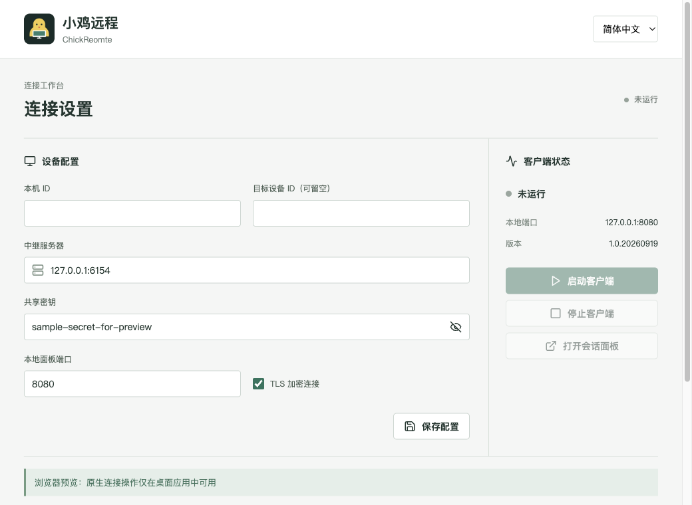

<div align="center">

<h2>ChickReomte</h2>
</div>

[简体中文](README.md) | **English**

[](https://github.com/Mutantcat-Working-Group/ChickRemote/actions/workflows/desktop.yml)
[](LICENSE)

### 1. Overview

- ChickReomte (小鸡远程) is a **self-hosted remote host management tool**. A Go relay server and clients provide browser access to remote terminals, desktops, and code-server development environments.
- Version **1.0.20260920** includes a Tauri 2 desktop client, command-line client and web dashboard. Desktop installers bundle the Go client; users do not need Go, Rust or Node.js.
- The same client program can act as either a controlling or a controlled device, differentiated by configuration alone; deployment is flexible and data never passes through a third-party service.

Core value: the relay and clients are entirely under your control, with terminal, desktop and development environment access consolidated into one self-hosted Go program, and TLS for transport across untrusted networks.

### 2. Interface

Desktop client interface preview:



The interface supports Chinese and English.

### 3. Features

#### Terminals and Remote Desktop

| Feature | Description |
| --- | --- |
| Web Shell | PTY terminals on Linux and macOS; PowerShell / CMD on Windows |
| Web remote desktop | Screen viewing, keyboard and mouse control, scrolling, and clipboard operations, subject to platform support |
| Remote development | Forwarding to code-server, which must be installed separately on the remote host |
| Dashboard | Rules, virtual links, sessions, and traffic statistics |

#### Transport and Deployment

| Feature | Description |
| --- | --- |
| Self-hosting | Your own relay, with outbound connections from clients |
| Transport | Protobuf messages, virtual link multiplexing, and optional TLS |
| Service operation | Foreground execution and system service registration |

#### How It Works

```text
Browser -> Local chickreomte-cli -> Relay chickreomte-svr <- Remote chickreomte-cli
```

- **Relay server**: forwards messages between clients; listens on TCP `6154` by default.
- **Local client**: opens the dashboard and rule entry points, and selects the remote client through `target`.
- **Remote client**: connects to the same relay and answers terminal, desktop and similar requests.

The full design is described in [Architecture and Implementation](docs/desc.md).

#### Platforms and Known Limitations

- The project includes Linux, Windows, and macOS implementations, with different capabilities. The current VNC backend does not support Windows / Linux ARM.
- **macOS**: a local MIT-licensed capture patch uses ScreenCaptureKit with modern SDKs, requiring macOS 14+. Intel and Apple Silicon are supported.
- **Windows**: web asset directories use symbolic links. Preserve these when checking out the repository, or replace them with their actual target files / directories.
- **code-server**: install it on the remote host and add it to `PATH`; it is not installed automatically by this project.
- Relative `log.dir` and `codedir` paths are resolved against the executable directory, not the configuration directory. Ensure these locations are writable or configure absolute paths.

### 4. Install and Download

Download the package for your platform from **[Releases](https://github.com/Mutantcat-Working-Group/ChickRemote/releases)**:

| Platform | Architecture | Package | Requirements |
| --- | --- | --- | --- |
| Windows | x64 | NSIS `.exe` | Offline WebView2 installer included |
| macOS | Apple Silicon / ARM64 | `.dmg` | macOS 14+, ad-hoc signed |
| macOS | Intel / x64 | `.dmg` | macOS 14+, ad-hoc signed |
| Linux | x64 | `.AppImage` | Executable permission, FUSE 2; X11 for remote capture |

Desktop installers bundle the Go client, so Go, Rust or Node.js are not required. Each Release includes `SHA256SUMS.txt` for verifying downloaded files.

Notes:

- The macOS app and DMG are ad-hoc signed, not Apple-notarized; allow the app in System Settings when prompted.
- Windows SmartScreen warnings are also possible.
- Linux remote capture uses X11 and therefore needs the corresponding OS permissions.

Installers are built by native runners and published only after launch checks, macOS ad-hoc signing and SHA-256 verification. Pushing a `v*` version tag makes GitHub Actions build the packages and upload them to the Release; manual workflow runs only produce CI artifacts and never publish a version.

### 5. Quick Start

#### 1. Start the Desktop Client

Enter a unique device ID, relay address, shared secret and optional target ID, then start the client and open sessions. Leave the target empty on a controlled device. Deploy a relay first; no public relay is bundled. TLS is enabled by default and must match the relay configuration. Grant Screen Recording and Accessibility permissions on controlled Macs.

Settings and logs live in the user's application data directory. The interface supports Chinese and English. Desktop settings create a VNC rule; advanced terminal and code-server rules remain available through CLI configuration. See the [desktop and release guide](docs/desktop.md).

#### 2. Prepare Configuration

Run these commands from the repository root with binaries built for your machine; see the next section for source builds. Release packages are listed under [Releases](https://github.com/Mutantcat-Working-Group/ChickRemote/releases). Older packages may use different names and contents from the current source tree.

| File | Purpose |
| --- | --- |
| `conf/server.yaml` | Relay port and TLS certificates |
| `conf/local.yaml` | Local client ID, relay address, dashboard, and rule includes |
| `conf/remote.yaml` | Remote client ID and relay address |
| `conf/common.yaml` | Shared secret, timeouts, and logging |
| `conf/rule.d/*.yaml` | Shell, VNC, and code-server rules |

**Update the example configuration before starting:**

- Replace `secret` in each machine's `common.yaml` with the same strong random secret. Never use the example value. You can generate one with `openssl rand -hex 32`; store it as a quoted YAML string.
- Point both clients' `server` settings to the same relay. Give each client a unique `id` and match each rule's `target` to the remote client's ID. The examples use `local` and `remote`.
- Set `dashboard.listen` in `local.yaml` and `local_addr` in the rule files to `127.0.0.1`. The examples currently use `0.0.0.0`, which listens on all interfaces.
- Configure TLS before deploying across untrusted networks; do not use the plaintext examples unchanged.

Configuration files use custom `#include` directives. Preserve `common.yaml`, `rule.d/`, and their relative directory layout when distributing configuration files. These directives are not ordinary YAML comments.

#### 3. Start the Three Roles

Run each command on its respective machine, or in three terminals for a local test:

```sh
# Relay server
./bin/chickreomte-svr --conf conf/server.yaml
```

```sh
# Remote client
./bin/chickreomte-cli --conf conf/remote.yaml
```

```sh
# Local client
./bin/chickreomte-cli --conf conf/local.yaml
```

After the clients connect, open [http://127.0.0.1:8080](http://127.0.0.1:8080) in the local client's browser. Rules without `local_port` receive dynamically allocated ports; open their endpoints from the dashboard.

Run as a regular user with the necessary permissions. Elevate privileges only for operations that require them, such as system service installation. Remote desktop access also requires relevant OS permissions, such as screen recording and accessibility.

#### 4. Optional: Register a System Service

Use a terminal with system service management privileges and replace the configuration path with its actual absolute path:

```sh
./bin/chickreomte-cli install --conf /absolute/path/to/conf/remote.yaml
./bin/chickreomte-cli start
./bin/chickreomte-cli status
./bin/chickreomte-cli stop
./bin/chickreomte-cli uninstall
```

The server supports the same subcommands through `chickreomte-svr`. `--user` belongs to the `install` subcommand, not foreground execution. When upgrading, stop and uninstall old services using the old binary before installing new services; retain your configuration and secrets.

### 6. Secure Deployment

- The dashboard and Shell, VNC, and code-server endpoints **do not provide independent login authentication**. Do not expose them directly to the internet. Use loopback binding, a VPN, or an authenticated reverse proxy, and restrict direct access to the endpoints.
- Relay TLS protects client-to-relay traffic only. It does not automatically provide HTTPS or authentication for browser-facing endpoints.
- Configure `tls.key` / `tls.crt` on the relay and set `ssl.enabled: true`, `ssl.insecure: false` on clients. Use trusted certificates and a matching server name.
- Treat the shared secret as a credential granting host access. Distribute it only to trusted participants and restrict network access to the relay and local endpoints.
- Connect only to devices you own or are explicitly authorized to manage. Remove secrets and sensitive host information from logs, screenshots, and issues before sharing them.

### 7. Development Status

- [x] Web terminals, remote desktops and code-server forwarding
- [x] Self-hosted relay and optional TLS transport
- [x] Bilingual Tauri 2 desktop client with a bundled Go engine
- [x] Windows NSIS, dual-architecture macOS DMGs and Linux AppImage
- [x] Version-tag-triggered CI packaging and Release publication
- [x] Package launch checks, macOS ad-hoc signing and SHA-256 verification

### 8. Build from Source

Install Git, Go, and the C/C++ toolchain and platform development libraries required by the client's native desktop dependencies. `go.mod` declares Go 1.18; actual build compatibility also depends on the platform, SDK, and dependency versions.

```sh
git clone https://github.com/Mutantcat-Working-Group/ChickRemote.git
cd ChickRemote
go mod download
sh build
```

The `build` script generates embedded web assets, then builds `bin/chickreomte-svr` and `bin/chickreomte-cli`. Do not skip asset generation when building the client from a fresh checkout.

The server can be built independently without native desktop dependencies:

```sh
go build -o bin/chickreomte-svr ./code/server
```

The Go module is `org.mutantcat.chickreomte`; internal package paths use that prefix. The GitHub repository URL is unchanged. Remote resolution for this custom module path is not configured, so clone the repository to build it instead of running `go get org.mutantcat.chickreomte`.

#### Tests

After `sh build` generates the assets and the platform dependencies are available, run:

```sh
go test ./...
```

Components independent of the native desktop backend can be tested separately:

```sh
go test ./code/network/... ./code/server/... ./code/hash ./code/utils
```

### 9. Project Structure

```text
.
├── code/               # Go client, relay and network protocols
├── conf/               # Example settings and rules
├── desktop/            # Tauri 2 desktop client and packaging scripts
├── html/               # Web dashboard, terminal and remote desktop
├── third_party/        # Locally maintained native desktop dependencies
├── docs/               # Deployment, rules, architecture and releases
├── .github/workflows/  # Native packages, Releases and CodeQL
├── logo.png            # Project logo
├── README.md           # Chinese documentation
├── README.en.md        # English documentation
├── CHANGELOG.md        # Version history
└── LICENSE             # MIT License
```

### 10. License

- This project is released under the MIT License; see [LICENSE](LICENSE).
- See the [desktop and release guide](docs/desktop.md) for platform and permission limitations, and the [changelog](CHANGELOG.md) for version history.
- Please report issues to [issues](https://github.com/Mutantcat-Working-Group/ChickRemote/issues).
